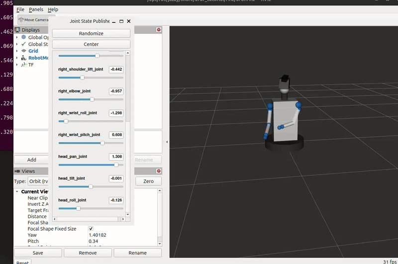

# eva2_0_description

**Owner:** Jai Bhugra  
**Role:** Arm Control Lead

---

## Contents

- `urdf/eva2_0.urdf` — Complete EVA 2.0 robot URDF (base, torso, both arms, head + Kinect)
- `scripts/servo_test.py` — Basic servo control node, publishes joint commands (P1-T2)
- `scripts/fk_node.py` — Forward kinematics node for left arm using DH parameters (P4-T1)

---

## Visualize URDF in RViz

```bash
- ros2 launch urdf_tutorial display.launch.py \
  model:=/path/to/eva2_0_description/urdf/eva2_0.urdf
```
- 

## Run FK Node

```bash
# Terminal 1 - RViz with joint sliders
ros2 launch urdf_tutorial display.launch.py \
  model:=/path/to/eva2_0_description/urdf/eva2_0.urdf

# Terminal 2 - FK node
python3 scripts/fk_node.py

# Terminal 3 - view end effector position
ros2 topic echo /eva2_0/left_arm/end_effector_pose
```

---

## Joint Structure

- Left arm: shoulder_pan → shoulder_lift → elbow → wrist_roll → wrist_pitch (5 DOF)
- Right arm: mirror of left (5 DOF)
- Head: pan → tilt → roll → kinect_link (fixed)

---

## DH Parameters — Left Arm

| Joint | theta | d | a | alpha |
|---|---|---|---|---|
| shoulder_pan | q1 | 0.06 | 0 | -π/2 |
| shoulder_lift | q2 | 0 | 0 | -π/2 |
| elbow | q3 | 0.18 | 0 | -π/2 |
| wrist_roll | q4 | 0.16 | 0 | π/2 |
| wrist_pitch | q5 | 0.04 | 0 | 0 |

---

## Phase Status

- [x] P1-T1: URDF model complete
- [x] P1-T2: Basic servo control node
- [x] P4-T1: Forward kinematics node (left arm)
- [ ] P4-T2: FK node for second arm + head
- [ ] P4-T3: Motion planning node
- [ ] P4-T4: Left arm controller
- [ ] P4-T5: Right arm controller
- [ ] P4-T6: Head controller
- [ ] P4-T7: A* path planning

---

> Note: Things shown here are subject to change
